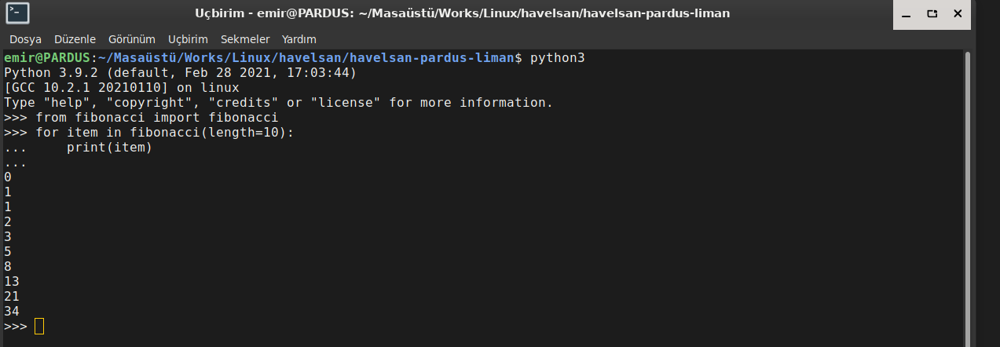

# HAVELSAN PARDUS - LİMAN KAMP

### 1 - Fibonacci
#### KURULUM

>> pip install py-fibonacci
#### Uçbirim üzerinden çalıştırma

-   python3
-   from fibonacci import fibonacci
-   for item in fibonacci(length=10):
    - print(item)

